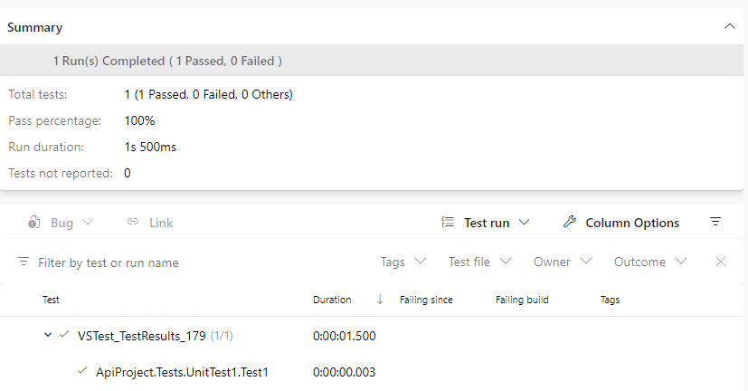
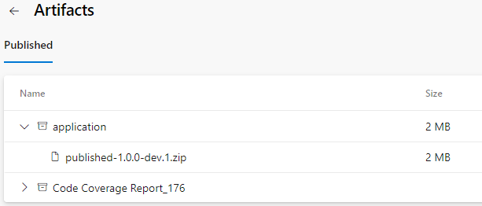
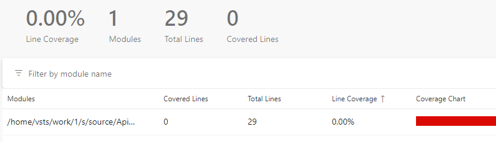

# Build stage template

The build stage is the first stage of every pipeline and is the main stage that builds the solutions, runs the unit tests and publishes an artifact for later stages usage.


For now, the template only includes the stage job.  
We may want to move to a full stage template as well.

```yaml
  - stage: build
    displayName: build and test
    jobs:
      - template: ./templates/azure-pipelines-build-template.yml
        parameters:
          name: 'build_soure'
          isReleaseBranch: false
```

The template defines 2 parameters. The `isReleaseBranch` is used for build number calculation and should only be set to `true` for the Main build.

## Calculate Build Number

The semantic version number is calculated based on the defined [version parameters](./variables-template.md) and the build triggers.  
This is done through a PowerShell step and script.

Following versioning format is calculated.

| build | version |
| -- | -- |
| **main** | 1.1.0-33 |
| **pull requests** | 1.1.0-pr.23 |
| **development** | 1.1.0-dev-543 |

This step also updates the code versioning `Directory.Build.props` or `package.json`, so that the source code is build with the correct version number.

## dotnet cli steps

The next steps is using the `dotnet cli` to build, test and publish our .NET application.  
For other technologies, we either change, or add steps to use their build tools (e.g. `npm`).

### Restore and Build

### Run unit tests

We use the `dotnet test` command to run the unit tests in our solution.  
The task automatically uploads the test results to visualize the execution in our stage.



### Publish project

We use the `dotnet publish` command to publish our .NET solution as a .zip file.  
We update the .zip file name to include the calculated version number and publish it as a stage artifact for later usage.



## Code Coverage

We run the unit tests with code coverage with [`coverlet.collector`](https://github.com/coverlet-coverage/coverlet)

After execution, we create a summary file of all coverage and publish it to the pipeline.

