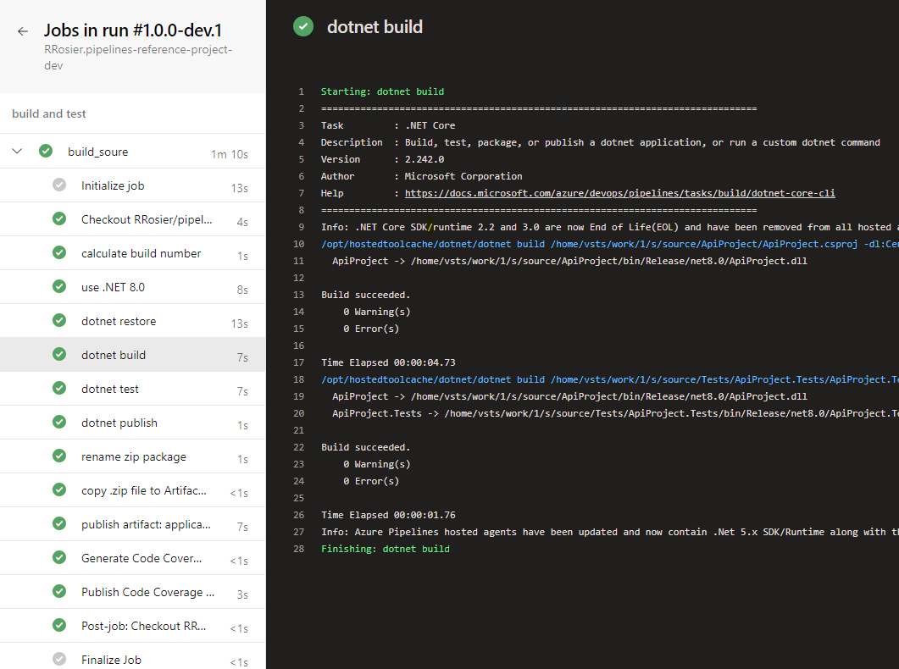

# Pipelines reference project

 This project combines all information I obtained over various years of creating DevOps CI and CD pipelines for various projects.  
 The knowledge so far is focussed on yaml pipelines configured and run on Azure DevOps primarily with Azure DevOps git repositories.  

 I created this project on my personal GitHub as a reference to me to go back to whenever I find myself back in the need of creating new pipelines for future projects.  
 Feel free to use this information as you want.  

 This project is using a simple .NET 8 solution, but can be easily adapted to other technologies or a combination of technologies (front-end/back-end).  

 I hope to update this project over time with new knowledge I obtain over the next years, including learning GitHub Actions.

 The pipelines defined for this project are configured and running in my [personal Azure DevOps project](https://dev.azure.com/RonaldRosier/GitHub/_build).  

| pipeline | status |  remarks |
|-- | -- | -- |
| Main branch |  | pipeline triggered on main branch (official code) |
| Dev branches |  | CI pipeline triggered on *any* development branch |
| Pull Requests |  | pipeline triggered on Pull Request check |  

## Pipelines description

I usually define 3 pipelines per project. They can be found in the [`builds/`](./builds/) folder.  

`azure-pipeline-dev.yml`  
This pipeline is a CI-triggered pipeline for any development on specific branches (based on your branching strategy).  
It contains mainly 1 stage running all the builds and unit tests of the solution and creating artifacts.  
It may also contain deployment stages to specific development or test environments.

`azure-pipeline-pr.yml`
The pr pipeline is the pipeline triggered on Pull Requests back into the main branch.  
It is a stripped-down build- and unit test stage, without publishing any artifacts.  
This can be extended based on your PR gate requests.

`azure-pipeline-main.yml`
This pipeline is triggered only on the main branch and can be either CI or manual triggered.  
Usually it will have multiple stages defined including deployments to various environments (test, staging, production).

`azure-pipeline-dev-test.yml`  
This pipeline I use to 'test' pipeline development.  
Whenever I update my yml pipelines, I will use this pipeline to verify the correct behavior. This removes unnecessary build-number increments when mistyping something :laughing:.

## Templates

I use templates to share stage definitions between the different pipelines.  
The templates are found in the [/builds/templates/](./builds/templates/) folder.

[variables template](./docs/variables-template.md)  
Configuration of global pipeline variables.

[build template](./docs/build-template.md)  
Steps for the build- and unit tests stage.

deploy template  
Steps for the deployment stages.

## Local executions

I find it important that the various steps (build, unit tests, code coverage, artifacts creation, etc) that are defined in the pipelines can also be run easily local.  
Therefore I usually create local PowerShell scripts that will execute these actions local as well.  
Certain steps will be developed in a script that are executed both from the pipelines or local.

`dev/` and `/scripts` will contain these automation scripts for the solution.

I am not a fan of creating 1 single script that you then run in a single step in the pipeline.  
I like to visualize my pipeline steps clearly, which is done nicely with Azure Pipelines.

